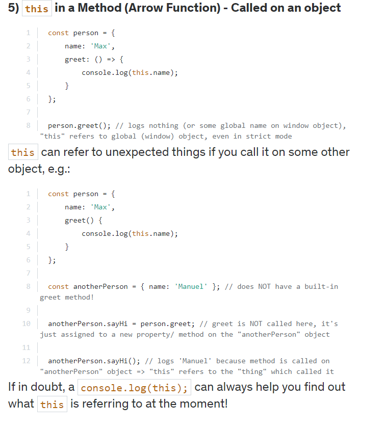

### existence

1. > if(key in obj)
2. > if(obj[key]!== undefined)

```js
const movie={
    info:{
        title:'raghava'
    },
    getFormattedName:function(){
        console.log(this.info.title)
    }
}
/*
this refers to the Object which is called
*/
console.log(movie.getFormattedName())//this refers to movie
const {getFormattedName} = movie
console.log(getFormattedName()) // error, this refers to window object
getFormattedName=getFormattedName.bind(movie)
console.log(getFormattedName())//bind will bind object for future execution
console.log(getFormattedName.apply(movie))//it will call directly , params are seperated by comma
console.log(getFormattedName.call(movie,[]))// it is same as call but extra params should pass as an array
```
```html
<button id="btn">search</button>
```
```js
document.getElementById(btn).addEventListener('click',searchMovie)
const searchMovie=function(){
    console.log(this)//for event , it returns html which it is called 
    //<button id="btn">search</button>
}
```

### "this" - Summary
The this keyword can lead to some headaches in JavaScript - this summary hopefully acts as a remedy.

this refers to different things, depending on where it's used and how (if used in a function) a function is called.

Generally, this refers to the "thing" which called a function (if used inside of a function). That can be the global context, an object or some bound data/ object (e.g. when the browser binds this to the button that triggered a click event).

1. #### this in Global Context (i.e. outside of any function)
```js
function something() { ... }
 
console.log(this); // logs global object (window in browser) - ALWAYS (also in strict mode)!
```
2. ### this in a Function (non-Arrow) - Called in the global context

```js
function something() { 
    console.log(this);
}
 
something(); // logs global object (window in browser) in non-strict mode, undefined in strict mode
```
3. ### this in an Arrow-Function - Called in the global context

```js
const something = () => { 
    console.log(this);
}
 
something(); // logs global object (window in browser) - ALWAYS (also in strict mode)!
```
4. ### this in a Method (non-Arrow) - Called on an object

```js
const person = { 
    name: 'Max',
    greet: function() { // or use method shorthand: greet() { ... }
        console.log(this.name);
    }
};
 
person.greet(); // logs 'Max', "this" refers to the person object
```
5. #### this in a Method (Arrow Function) - Called on an object

